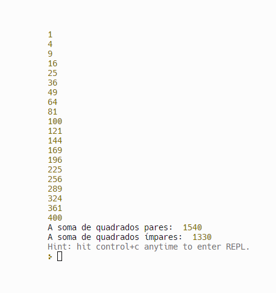

## Instituto Federal do Espírito Santo

# Sandra-F-JavaScript-Pratica-da-Semana-3
# https://github.com/mjpfelicia

                 Welcome! 👋
                 

## Índice

- Desafio
- Links
- Tecnologias usadas
- O que eu aprendi
- Recursos úteis
- Desafio

## Links usados:

- https://developer.mozilla.org/en-US/docs/Web/JavaScript/Reference/Statements/for
- https://youtu.be/0C3K9DAalCs?si=QZ_vVhph8XswB9wb

## Tecnologias usadas:
- Javascript

## O que eu aprendi

- Implementar comando de repetição (for)
- Implementar os comandos de decisão para verificar números quadrados pares ou ímpares
- Praticando para melhorar o javascript- -

## Autor
- @mjpfelicia
